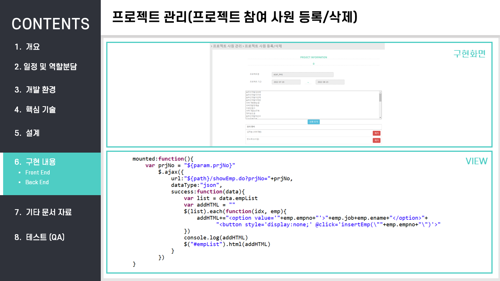

### 프로젝트 Description

------

#### 	1. 프로젝트명

#### 	2. 프로젝트 소개

### 프로젝트 정보

------

#### 	1. 개발 환경

#### 2. 구현범위

#### 3. 핵심기술

### 프로젝트 결과물

------

#### 1. 화면설계서 - UI 설계

#### 2. 플로우차트

#### 3. 사이트맵

#### 4. ERD

#### 5. 구현 내용

